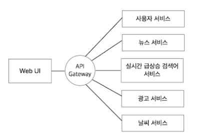

## API GATEWAY란
- 서비스로 전달되는 모든 API 요청의 관문 역할을 하는 서버 시스템의 아키텍처를 내부로 숨기고 외부의 요청에 대한 응답만을 적절한 형태로 응답
- 클라이언트는 내부 구조가 뭔지 알 필요 없이 약속한 형태의 API 요청만을 서버로 보내면 됨

## API GATEWAY의 장점
- 클라이언트의 요청을 일괄적으로 처리
- 전체 시스템의 부하를 분산 시키는 로드 밸런서의 역할
- 동일한 요청에 대한 불필요한 반복작업을 줄일 수 있는 캐싱
- 시스템상을 오고가는 요청과 응답에 대한 모니터링
- 시스템 내부에 아키텍처를 숨길 수 있음

