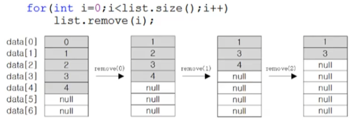
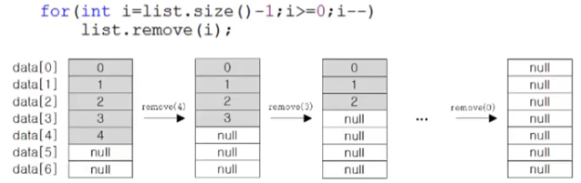

# ArrayList
- ArrayList는 기조의 Vector를 개선한 것으로 구현원리와 기능적으로 동일
- ArrayList와 달리 Vector는 자체적으로 동기화처리가 되어 있다.
- List인터페이스를 구현하므로, 저장순서가 유지되고 중복을 허용한다.
- 데이터의 저장공간으로 배열을 사용한다.(배열기반)

### ArrayList의 메서드
- 생성자
  - ArrayList() : 기본 생성자
  - ArrayList(Collection c)
  - ArrayList(int initialCapacity) : 배열의 길이, 처음에 적절하게 설정
- 추가
  - boolean add(Object o) : 성공 true, 실패 false
  - void add(int index, Object element) : 저장위치 지정
  - boolean addAll(Collection c)
  - boolean addAll(int index, Collection c)
- 삭제
  - boolean remove(Object o)
  - Object remove(int index)
  - boolean removeAll(Collection c)
  - void clear() : 모든 객체 삭제
- 검색
  - int indexOf(Object o) : 못 찾으면 -1
  - int lastIndexOf(Object o)
  - boolean contains(Object o)
  - Object get(int index) : 특정 위치 객체 반환
  - Object set(int index, Object element) : 변경
  - List subList(int fromIndex, int toIndex) : 일부 뽑아내서 새로운 리스트 생성
  - Object[] toArray() : ArrayList의 객체 배열을 반환
  - Object[] toArray(Object[] a)
  - boolean isEmpty()
  - void trimToSize() : 빈공간 제거
  - int size() : 저장된 객체의 갯수 반환

    
### ArrayList에 저장된 객체의 삭제
- 삭제 과정
  1. 삭제할 데이터 아래의 데이터를 한 칸씩 위로 복사해서 삭제할 데이터를 덮어쓴다.
  2. 데이터가 모두 한 칸씩 이동했으므로 마지막 데이터는 null로 변경한다.
  3. 데이터가 삭제되어 데이터의 개수가 줄었으므로 size의 값을 감소시킨다.
  4. 마지막 데이터를 삭제하는 경우, 1 의 과정(배열의 복사)은 필요 없다.
- ArrayList에 저장된 첫 번째 객체부터 삭제하는 경우 - 배열 복사 발생

- ArrayList에 저장된 마지막 객체부터 삭제하는 경우 - 배열 복사 발생 안함, 빠름

# LinkedList
### 배열의 장단점
#### 장점
- 배열은 구조가 간단하고 데이터를 읽는 데 걸리는 시간(접근시간, access time)이 짧다.
#### 단점
- 크기를 변경할 수 없다.
  - 크기를 변경해야 하는 경우 새로운 배열을 생성 후 데이터를 복사해야한다.
  - 크기 변경을 피하기 위해 충분히 큰 배열을 생성하면, 메모리가 낭비된다.
- 비순차적인 데이터의 추가, 삭제에 시간이 많이 걸린다.
  - 데이터를 추가하거나 삭제하기 위해, 다른 데이터를 옮겨야 함.
  - 그러나 순차적인 데이터 추가(끝에 추가)와 삭제(끝부터 삭제)는 빠르다.

### LinkedList 
- 배열의 단점을 보완
- 배열과 달리 LinkedList는 불연속적으로 존재하는 데이터를 연결
- 데이터 삭제 : 단 한 번의 참조변경만으로 가능
- 데이터의 추가 : 한 번의 Node 객체 생성과 두 번의 참조변경만으로 가능
- 단점 : 데이터 접근성이 나쁨
- doublyLinkedList : 이중 연결리스트, 접근성 향상
- doublyCircularLinkedList : 이중 원형 연결리스트

### ArrayList vs LinkedList - 성능 비교
1. 순차적으로 데이터를 추가/삭제 - ArrayList가 빠름
2. 비순차적으로 데이터를 추가/삭제 - LinkedList가 빠름
3. 접근시간(읽기) - ArrayList가 빠름