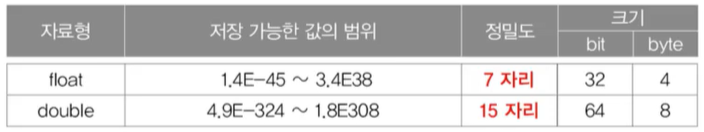

# 기본형과 참조형

### 기본형 (Primitive type)
- 오직 8개 (boolean, char, byte, short, int, long, float, double)
- 실제 값을 저장

### 참조형 (Reference type)
- 기본형을 제외한 나머지 (String, System 등)
- 메모리 주소를 저장 (4 byte 또는 8 byte)
```java
Date today;   //참조형 변수 today를 선언
today = new Date();  //today에 객체의 주소를 저장
```

### 기본형 - 종류와 크기
논리형 - true와 false 중 하나를 값으로 갖으며, 조건식과 논리적 계산에 사용된다.

문자형 - 문자를 저장하는데 사용되며, 변수 당 하나의 문자만을 저장할 수 있다.

정수형 - 정수 값을 저장하는데 사용된다. 주로 사용하는 것은 int 와 long 이며, byte는 이진 데이터를 다루는데 사용되며, short은 c언어와의 호환을 위해 추가되었다.(잘 안쓰임)

실수형 - 실수 값을 저장하는데 사용된다. float와 double이 있다.

|크기| 1       |2|4|8|
|----|---------|----|----|----|
|논리형| boolean ||||
|문자형|         | char| | |
|정수형|byte|short|int|long|
|실수형| | |float|double|

### 기본형 - 표현범위

1 byte = 8 bit

n비트로 표현할 수 있는 값의 개수 : 2<sup>n</sup>개

n비트로 표현할 수 있는 부호없는 정수의 범위 : 0 ~ 2<sup>n</sup> - 1

n비트로 표현할 수 있는 부호있는 정수의 범위 : - 2<sup>n-1</sup> ~ 2<sup>n-1</sup> - 1

byte : -2<sup>7</sup> ~ 2<sup>7</sup> - 1 &nbsp;&nbsp;&nbsp;&nbsp;&nbsp;(-128 ~ 127)

short : -2<sup>15</sup> ~ 2<sup>15</sup> - 1 &nbsp;&nbsp;&nbsp;&nbsp;&nbsp;(-32768 ~ 32767)

char : 0 ~ 2<sup>16</sup> - 1 &nbsp;&nbsp;&nbsp;&nbsp;&nbsp; (0 ~ 65535)

int : -2<sup>31</sup> ~ 2<sup>31</sup> - 1 &nbsp;&nbsp;&nbsp;&nbsp;&nbsp;(-20억 ~ 20억)

