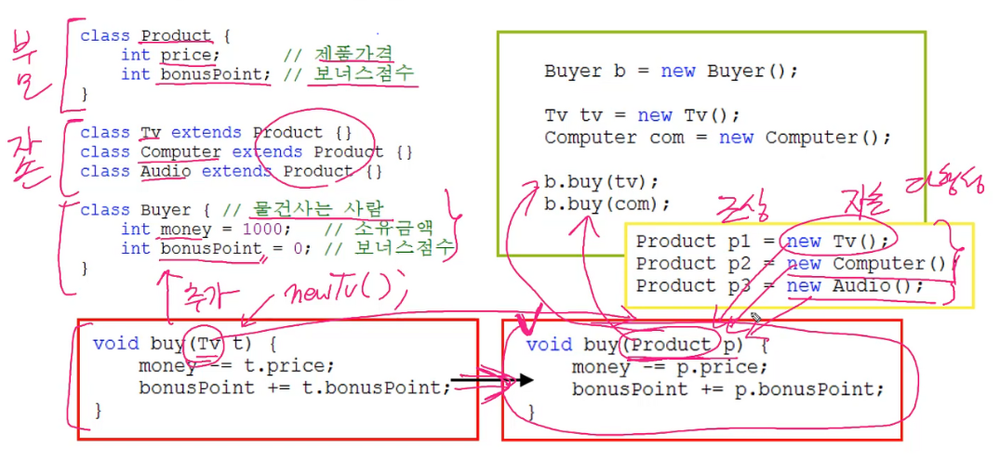

## 다형성
- 장점 
  - 조상 타입 참조 변수로 자손 타입 객체를 다루는 것
  - 하나의 배열에 여러 종류의 객체 저장
- 참조 변수가 사용할 수 있는 멤버의 개수는 인스턴스의 멤버 개수보다 같거나 적어야 한다.
- 참조 변수 타입과 인스턴스 타입은 보통 일치하지만 일치하지 않을 수도 있다.
```java
class Tv { .....}
class SamrtTv extends Tv { .....}

SmartTv s = new SmartTv();        // 참조 변수와 인스턴스의 타입이 일치
Tv t = new SamrtTv();             // 조상 타입 참조변수로 자손 타입 인스턴스 참조
SmartTv s = new Tv();             // 에러 허용 안 됨
```

## 참조 변수의 형변환
- (리모컨을 변경해서) 사용할 수 있는 멤버의 개수를 조절
- 조상, 자손 관계의 참조 변수는 서로 형변환이 가능(형제 관계는 X)
- 리모컨 기능이 많은 쪽에서 적은 쪽으로 줄이는 경우 안전 (자손 -> 조상)
- 적은 쪽을 늘릴 경우 형변환 필수 (조상 -> 자손)
```java
class Car { ..... }
class FireEngine extends Car { ..... }
class Ambulance extends Car { ..... }

FireEngine f = new FireEngine();

Car c = (Car) f;                  // OK     조상인 Car 타입으로 형변환(생략가능)
FireEngine f2 = (FireEngine) c;   // OK     자손인 FireEngine 타입으로 형변환(생략불가)
Ambulance a = (Ambulance) f;      // ERROR  상속관계가 아닌 클래스 간의 형변환 불가
```

## instanceof 연산자
- 참조 변수의 형변환 가능여부 확인용. 가능하면 true 변환
- 형변환 전에 반드시 instanceof 로 확인
- 주로 조건문에 사용
```java
void doWork(Car c) {        //car 또는  car의 모든 자손 들어갈 수 있음
    if (c instanceof FireEngine) {           뭐가 들어올지 모르니까 확인하고 형변환
        FireEngine fe = (FireEngine)c;       형변환
        fe.water();
    }
    else if ~~
}


FireEngine fe = new FireEngine();
System.out.println(fe instanceof Object);             //true
System.out.println(fe instanceof Car);                //true
System.out.println(fe instanceof FireEngine);         //true
```

## 매개변수의 다형성
- 참조형 매개변수는 메서드 호출 시 자신과 같은 타입 또는 자손 타입의 인스턴스를 넘겨줄 수 있다.



## 여러 종류의 객체를 배열로 다루기
- 조상 타입의 배열에 자손 타입 객체를 담을 수 있다.
- 다루고 싶은 객체들의 상속 관계를 따져서 가장 가까운 공통 조상 클래스 타입의 참조 변수 배열을 생성해서 객체들을 저장
```java
Product p[] = new Product[3];
p[0] = new Tv();
p[1] = new Computer();
p[2] = new Audio();
```
ex)
```java
class Exercise {
	public static void main(String[] args) {
		Parent p = new Child();
		Child c = new Child();
		System.out.println("p.x = " + p.x);
		p.method();
		System.out.println("c.x = " + c.x);
		c.method();
	}
}

class Parent {
	int x = 100;
	void method() {
		System.out.println("Parent Method");
	}
}

class Child extends Parent {
	int x = 200;
	void method() {
		System.out.println("Child Method");
	}
}


/*정답
p.x = 100
Child Method
c.x = 200
Child Method
 */
```
조상 클래스의 메서드를 자손의 클래스에서 오버라이딩한 경우에도 참조변수의 타입에 관계없이 항상 실제(자식) 인스턴스의 메서드가 호출되지만, 멤버변수의 경우 참조변수의 타입에 따라 달라진다.
