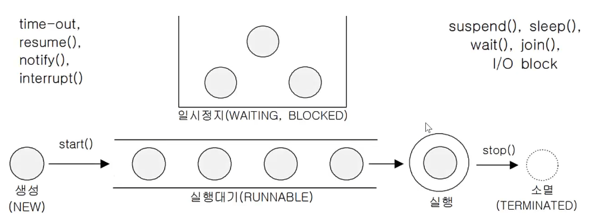

### 프로세스와 쓰레드
프로세스 : 실행 중인 프로그램, 자원(resources)과 쓰레드로 구성

쓰레드 : 프로세스 내에서 실제 작업을 수행. 모든 프로세스는 최소한 하나의 쓰레드를 가지고 있다.

싱글 쓰레드 프로세스 : 자원 + 쓰레드

멀티 쓰레드 프로세스 : 자원 + 쓰레드 + 쓰레드 + 쓰레드 + .... + 쓰레드

"하나의 새로운 프로세스를 생성하는 것보다 하나의 새로운 쓰레드를 생성하는 것이 더 적은 비용이 든다."


### 멀티 쓰레드의 장단점
- 장점
  - 시스템 자원을 보다 효율적으로 사용할 수 있다.
  - 사용자에 대한 응답성(responseness)이 향상된다.
  - 작업이 분리되어 코드가 간결해진다.
- 단점
  - 동기화(synchronization)에 주의해야 한다.
  - 교착상태(dead-lock)가 발생하지 않도록 주의해야 한다.
  - 각 쓰레드가 효율적으로 고르게 실행될 수 있게 해야 한다.

### 쓰레드의 구현과 실행
1. Thread 클래스를 상속
```java
class MyThread extends Thread {
    public void run() {   //Thread 클래스의 run()을 오버라이딩
        
    }
}
//사용
MyThread t1 = new MyThread(); // 쓰레드의 생성
t1.start();  // 쓰레드의 실행
```
2. Runnable 인터페이스를 구현(더 나음)
```java
class MyThread2 implements Runnable {
    public void run() {    //Runnable 인터페이스의 추상메서드 run()을 구현
        
    }
}
// 사용
Runnable r = new MyThread2();
Thread t2 = new Thread(r);  // Thread(Runnable r)
//Thread t2 = new Thread(new MyThread2());
t2.start();
```

### 쓰레드의 실행 - start()
- 쓰레드를 생성한 후에 start()를 호출해야 쓰레드가 작업을 시작한다
- 주의 사항
  - start를 했다고 즉시 실행되는 것이 아님
  - 먼저 start되었다고 먼저 실행되는 것이 아님
- start()를 하면 별도의 새로운 호출스택 생성 &rarr; 서로 독립적으로 작업 수행

### main 쓰레드
- main 메서드의 코드를 수행하는 쓰레드
- 쓰레드는 '사용자 쓰레드'와 '데몬 쓰레드(보조 쓰레드)' 두 종류가 있다.
- **실행중인 사용자가 쓰레드가 하나도 없을 때 프로그램은 종료된다.**

### 쓰레드의 I/O 블락킹(입출력시 작업 중단)
싱글 쓰레드 : 사용자로부터 입력을 기다리는 구간 &rarr;  아무 일도 하지 않는다.

멀티 쓰레드 : 사용자로부터 입력을 기다리는 구간 &rarr; th2 가 수행된다.

### 쓰레드의 우선순위
- 작업의 중요도에 따라 쓰레드의 우선순위를 다르게 하여 특정 쓰레드가 더 많은 작업시간을 갖게 할 수 있다.
```java
void setPriority(int newPriority) // 쓰레드의 우선순위를 지정한 값으로 변경
int getPriority() // 쓰레드의 우선순위를 반환한다

1 - 최소 우선 순위
5 - 보통 우선 순위(default)
10 - 최대 우선 순위
```

### 쓰레드 그룹
- 서로 관련된 쓰레드를 그룹으로 묶어서 다루기 위한 것
- 모든 쓰레드는 반드시 하나의 쓰레드 그룹에 포함되어 있어야 한다.
- 쓰레드 그룹을 지정하지 않고 생성한 쓰레드는 'main 쓰레드 그룹' 에 속한다.
- 자신을 생성한 쓰레드(부모 쓰레드)의 그룹과 우선순위를 상속받는다.
```java
Thread(ThreadGroup group, String name)
Thread(ThreadGroup group, Runnable target)
Thread(ThreadGroup group, Runnable target, String name)
Thread(ThreadGroup group, Runnable target, String name, long stackSize)

ThreadGroup getThreadGroup()  //쓰레드 자신이 속한 쓰레드 그룹을 반환한다.
void uncaughtException(Thread t, Throwable e)
//처리되지 않은 예외에 의해 쓰레드 그룹의 쓰레드가 실행이 종료되었을 때, JVM에 의해 이 메서드가 자동적으로 호출된다.
```

### 데몬 쓰레드
- 일반 쓰레드의 작업을 돕는 보조적인 역할을 수행
- 일반 쓰레드가 모두 종료되면 자동적으로 종료된다.
- 가비지 컬렉터, 자동 저장, 화면 자동갱신 등에 사용된다.
- 무한루프와 조건문을 이용해서 실행 후 대기하다가 특정조건이 만족되면 작업을 수행하고 다시 대기하도록 작성한다.
- boolean isDaemon() - 쓰레드가 데몬 쓰레드인지 확인한다. 데몬 쓰레드이면 true를 반환
- void setDaemon(boolean on) - 쓰레드를 데몬 쓰레드로 또는 사용자 쓰레드로 변경. 매개변수 on을 true로 지정하면 데몬 쓰레드가 된다.
- setDaemon(boolean on)은 반드시 start()를 호출하기 전에 실행되어야 한다. 그렇지 않으면 IllegalThreadStateException이 발생한다.

### 쓰레드의 상태
|상태|설명|
|----|----|
|NEW|쓰레드가 생성되고 아직 start()가 호출되지 않은 상태|
|RUNNABLE|실행 중 또는 실행 가능한 상태|
|BLOCKED|동기화 블럭에 의해서 일시정지된 상태(lock이 풀릴 때까지 기다리는 상태)|
|WAITING, TIMED_WAITING|쓰레드의 작업이 종료되지는 않았지만 실행가능하지 않은(unrunnable) 일시정지상태. TIMED_WAITING은 일시정지시간이 지정된 경우를 의미|
|TERMINATED|쓰레드의 작업이 종료된 상태|

### 쓰레드의 실행제어
쓰레드의 실행을 제어할 수 있는 메서드가 제공된다. 이들을 활용해서 보다 효율적인 프로그램을 작성할 수 있다.

| 메서드                                                                           | 설명                                                                         |
|-------------------------------------------------------------------------------|----------------------------------------------------------------------------|
| static void sleep(long millis) <br/>static void sleep(long millis, int nanos) | 지정된 시간(천분의 일초 단위)동안 쓰레드를 일시정지시킨다. 지정한 시간이 지나고 나면, 자동적으로 다시 **실행대기상태**가 된다. |
| void join()<br/>void join(long millis) <br/>void join(long millis, int nanos) | 다른 쓰레드가 작업하는 것을 기다림                                                        |
| void interrupt()                                                              | sleep()이나 join()에 의해 일시정지상태인 쓰레드를 깨워서 실행대기상태로 만든다.                         |
| void stop()                                                                   | 쓰레드를 즉시 종료시킨다.                                                             |
| void suspend()                                                                | 쓰레드를 일시 정지시킨다. resume()을 호출하면 다시 실행대기상태가 된다.                               |
| void resume()                                                                 | suspend()에 의해 일시정지상태에 있는 쓰레드를 실행대기상태로 만든다.                                 |
| static void yield()                                                           | 실행 중인 자신에게 주어진 실행시간을 다른 쓰레드에게 양보하고 자신은 실행대기상태가 된다.|

### sleep()
- 현재 쓰레드를 지정된 시간동안 멈추게 한다.
- 예외처리를 해야 한다.(InterruptedException 이 발생하면 깨어남)
```java
try {
    Thread.sleep(1, 500000);
} catch (InterruptedException e) {}
```
- 자기 자신에게 적용되는 메서드이기 때문에 특정 쓰레드를 지정해서 멈추게 하는 것은 불가능하다.

### interrupt()
- 대기상태인 쓰레드를 실행대기 상태로 만든다
  - void interrupt() : 쓰레드의 interrupted 상태를 false에서 true로 변경.
  - boolean isInterrupted() : 쓰레드의 interrupted 상태를 반환.
  - static boolean interrupted() : 현재 쓰레드의 interrupted 상태를 알려주고, false로 초기화

### suspend(), resume(), stop()
- 쓰레드의 실행을 일시정지, 재개, 완전 정지 시킨다.
  - void suspend() : 쓰레드를 일시정지 시킨다.
  - void resume() : suspend()에 의해 일시정지된 쓰레드를 실행대기상태로 만든다.
  - void stop() : 쓰레드를 즉시 종료시킨다.
- 교착상태에 빠지기 쉬워서 deprecated 됨


### join()
- 지정된 시간동안 특정 쓰레드가 작업하는 것을 기다린다.
  - void join() : 작업이 모두 끝날 때까지
  - void join(long millis) : 천분의 일초 동안
  - void join(long millis, int nanos)  : 천분의 일초 + 나노초 동안
- 예외 처리를 해야 한다.(InterruptedException이 발생하면 작업 재개)
```java
try {
    th1.join();  //main 쓰레드가 th1의 작업이 끝날 때까지 기다린다.
    th2.join();  //main 쓰레드가 th2의 작업이 끝날 때까지 기다린다.
} catch (InterruptedException e) {}
```

### yield()
- 남은 시간을 다음 쓰레드에게 양보하고, 자신(현재 쓰레드)은 실행대기한다.
- yield()와 interrupt()를 적절히 사용하면, 응답성과 효율을 높일 수 있다.

### 쓰레드의 동기화
- 멀티 쓰레드 프로세스에서는 다른 쓰레드의 작업에 영향을 미칠 수 있다.
- 진행중인 작업이 다른 쓰레드에게 간섭받지 않게 하려면 '동기화'가 필요
  - 쓰레드의 동기화 - 한 쓰레드가 진행중인 작업을 다른 쓰레드가 간섭하지 못하게 막는 것
- 동기화하려면 간섭받지 않아야 하는 문장들을 '임계 영역'으로 설정
- 임계영역은 락(lock)을 얻은 단 하나의 쓰레드만 출입가능(객체 1개에 락 1개)

### synchronized를 이용한 동기화
- synchronized로 임계영역(lock이 걸리는 영역)을 설정하는 방법 2가지
```java
1. 메서드 전체를 임계 영역으로 지정
public synchronized void calcSum(){
}
2. 특정한 영역을 임계 영역으로 지정
synchronized(객체의 참조변수) {
}
```

### wait()과 notify()
- 동기화의 효율을 높이기 위해 wait(), notify()를 사용.
- Object 클래스에 정의되어 있으며, 동기화 블록 내에서만 사용할 수 있다.
  - wait() - 객체의 lock을 풀고 쓰레드를 해당 객체의 waiting pool에 넣는다.
  - notify() - waiting pool에서 대기중인 쓰레드 중의 하나를 깨운다.
  - notifyAll() - waiting pool에서 대기중인 모든 쓰레드를 깨운다.