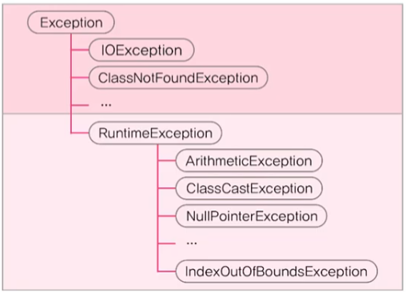

### 프로그램 오류
1. 컴파일 에러(compile-time error) : 컴파일 할 때 발생하는 에러
2. 런타임 에러(runtime error) : 실행 할 때 발생하는 에러 (프로그램 종료)
3. 논리적 에러(logical error) : 작성 의도와 다르게 동작 (프로그램 종료 X)

- Java의 런타임 에러
  - 에러(error) : 프로그램 코드에 의해서 수습될 수 없는 심각한 오류
  - 예외(exception) : 프로그램 코드에 의해서 수습될 수 있는 다소 미약한 오류
- 에러(error)는 어쩔 수 없지만, 예외(exception)는 처리하자.
- 예외처리의 정의와 목적
  - 정의 : 프로그램 실행 시 발생할 수 있는 예외의 발생에 대비한 코드를 작성하는 것
  - 목적 : 프로그램의 비정상 종료를 막고 정상적인 실행상태를 유지하는 것

### Exception과 RuntimeException
- Exception 클래스들 : 사용자의 실수와 같은 외적인 요인에 의해 발생하는 예외
- RuntimeException 클래스들 : 프로그래머의 실수로 발생하는 예외



#### 프로그램 오류
- 컴파일 에러
- 런타임 에러
  - Error : 심각한 에러
  - Exception : 미약한 에러
    - Exception과 그 자손들
    - RuntimeException과 그 자손들
- 논리적 에러

&rarr; try-catch 문을 통해 해결

### printStackTrace()와 getMessage()
- printStackTrace() : 예외발생 당시의 호출스택(Call Stack)에 있었던 메서드의 정보와 예외 메시지를 화면에 출력한다.
- getMessage() : 발생한 예외클래스의 인스턴스에 저장된 메시지를 얻을 수 있다.
```java
try {
        ...
        System.out.println(0/0);   //예외발생
        ...
} catch (ArithmeticException ae) {
    ae.printStackTrace();
    System.out.println(ae.getMessage());
} catch (Exception e) {
        ...
}
```

### 멀티 catch 블럭
내용이 같은 catch 블럭을 하나로 합친 것
```java
try {
} catch (ExceptionA | ExceptionnB e) {
}

//에러
catch (ParentException | ChildException e)  //부모 자식 관계 X

catch (ExceptionA | ExceptionB e) {
    e.methodA();          //ExceptionA에 선언된 methodA()는 호출 불가 (어떤 에러인지 모르기 때문에)
}
```

### finally 블럭
- 예외 발생여부와 관계없이 수행되어야 하는 코드를 넣는다.
- try-catch 블럭의 맨 마지막에 위치해야한다.

### checked 예외, unchecked예외
- checked 예외 : 컴파일러가 예외 처리 여부를 체크 (예외 처리 필수) &rarr; Exception 과 자손
- unchecked 예외 : 컴파일러가 예외 처리 여부를 체크 안함 (예외 처리 선택) &rarr; RuntimeException 과 자손

### 메서드에 예외 선언하기
- 예외를 처리하는 방법 : 1. try-catch문. 예외 선언하기(예외 떠넘기기)
- 메서드가 호출시 발생가능한 예외를 호출하는 쪽에 알리는 것
```java
class ex {
  public static void main(String[] args) throws Exception{
    method1();
  }
  static void method1() throws Exception {
      method2();
  }
  static void method2() throws Exception {
      throw new Exception();
  }
}
```

### 사용자 정의 예외 만들기
- 우리가 직접 예외 클래스를 정의할 수 있다.
- 조상은 Exception과 RuntimeException 중에서 선택
```java
class MyException extends Exception {
    MyException(String msg) {     // 문자열을 매개변수로 받는 생성자
        super(msg);         // 조상인 Exception 클래스의 생성자를 호출
    }
}
```

### 예외 되던지기(exception re-throwing)
- 예외를 처리한 후에 다시 예외를 발생시키는 것
- 호출한 메서드와 호출된 메서드 양쪽 모두에서 예외처리하는 것
```java
class ex {
  public static void main(String[] args) {
    try {
        method1();
    } catch (Exception e) {
      System.out.println("main 메서드 예외 처리");
    }
  }
  
  static void method1() throws Exception {
      try {
          throw new Exception();
      } catch (Exception e) {
        System.out.println("method1 예외 처리");
        throw e;      //catch로 예외 처리하는데 다시 발생
      }
  }
}
```

### 연결된 예외(chained exception)
- 한 예외가 다른 예외를 발생시킬 수 있다.
- 예외 A가 예외 B를 발생시키면, A는 B의 원인 예외(cause exception)

Throwable initCause(Throwable cause) &nbsp;&nbsp;&nbsp;&nbsp;지정한 예외를 원인 예외로 등록

Throwable getCause() &nbsp;&nbsp;&nbsp;&nbsp;&nbsp;&nbsp;&nbsp;&nbsp;&nbsp;&nbsp;&nbsp;&nbsp;&nbsp;&nbsp;&nbsp;&nbsp;&nbsp;&nbsp;&nbsp;&nbsp;&nbsp;&nbsp;&nbsp;&nbsp;&nbsp;&nbsp;&nbsp;&nbsp;&nbsp;&nbsp;&nbsp;&nbsp;원인 예외를 반환

이유1. 여러 예외를 하나로 묶어서 다루기 위해서
이유2. checked 예외를 unchecked 예외로 변경하려 할 때