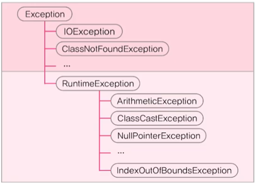

### 프로그램 오류
1. 컴파일 에러(compile-time error) : 컴파일 할 때 발생하는 에러
2. 런타임 에러(runtime error) : 실행 할 때 발생하는 에러 (프로그램 종료)
3. 논리적 에러(logical error) : 작성 의도와 다르게 동작 (프로그램 종료 X)

- Java의 런타임 에러
  - 에러(error) : 프로그램 코드에 의해서 수습될 수 없는 심각한 오류
  - 예외(exception) : 프로그램 코드에 의해서 수습될 수 있는 다소 미약한 오류
- 에러(error)는 어쩔 수 없지만, 예외(exception)는 처리하자.
- 예외처리의 정의와 목적
  - 정의 : 프로그램 실행 시 발생할 수 있는 예외의 발생에 대비한 코드를 작성하는 것
  - 목적 : 프로그램의 비정상 종료를 막고 정상적인 실행상태를 유지하는 것

### Exception과 RuntimeException
- Exception 클래스들 : 사용자의 실수와 같은 외적인 요인에 의해 발생하는 예외
- RuntimeException 클래스들 : 프로그래머의 실수로 발생하는 예외

